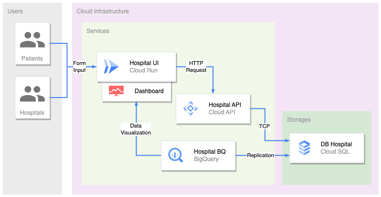

[![Go-lang][Go-lang]][Go-url]

<!-- PROJECT LOGO -->

  

 
<h1 align="center">Soal Tech Lead BE 1</h1>

### About This Repository
Berikut adalah sebuah repository dari aplikasi Hospital berbentuk REST API yang menggunakan bahasa pemrograman **Golang**. 

Aplikasi ini adalah aplikasi platform Rumah Sakit, terdapat beberapa endpoints yang digunakan untuk melakukan insert & get data ke database **MySQL**.

> Silahkan lakukan **Code Review** dan **Software Design/Architecture Review** terhadap repository ini. **Good Luck!**

(<a href="#readme-top">back to top</a>)

<!-- MARKDOWN LINKS & IMAGES -->
[Go-lang]: https://img.shields.io/badge/go-%2300ADD8.svg?style=for-the-badge&logo=go&logoColor=white
[Go-url]: https://go.dev/